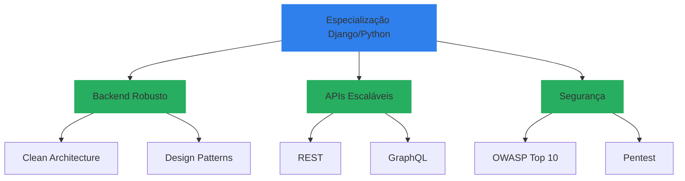

# <div align="center">Olá!  Eu sou José Ferreira</div>

<div align="center">
  <a href="https://git.io/typing-svg">
    
  </a>
</div>

> 💡 **Desenvolvedor Backend Python/Django** apaixonado por construir APIs robustas e escaláveis. Combinando expertise matemática com engenharia de software para criar soluções elegantes e eficientes. Especialista em Segurança da Informação e Big Data.

<div align="center">
  <a href="https://www.linkedin.com/in/josé-ferreira-9a659a242/">
    
  </a>
  <a href="https://api.whatsapp.com/send?phone=+5588993693516">
    
  </a>
  <a href="mailto:jjose150697@gmail.com">
    
  </a>
</div>

## 🎯 Especialidades

```python
class DjangoSpecialist:
    def __init__(self):
        self.core_stack = {
            "backend": ["Django", "Django REST Framework", "Django Ninja", "Celery"],
            "frontend": ["HTML5", "CSS3", "JavaScript"],
            "database": ["PostgreSQL", "MySQL", "Redis", Supabase],
            "practices": ["Clean Architecture", "TDD", "API RESTful", "SOLID", "N8N"]
        }
        
        self.security_expertise = {
            "frameworks": ["Django Security Middleware", "JWT", "OAuth2"],
            "practices": ["OWASP Top 10", "Security Headers", "Data Encryption"],
            "tools": ["SSL/TLS", "Security Auditing", "Penetration Testing"]
        }
        
        self.differentials = {
            "backend_focus": "Especialista Django/DRF",
            "security": "Expert em Segurança da Informação",
            "mathematics": "Fundamentos Matemáticos Sólidos",
            "architecture": "Clean Code & Best Practices"
        }
    
    def solve_complex_problems(self):
        """Combinando pensamento matemático com engenharia de software"""
        return ["Arquitetura Escalável", "Código Limpo", "Soluções Eficientes"]
```

## 🚀 Domínio Técnico

<details>
<summary>🐍 Stack Python/Django</summary>

### Backend Expertise


### Frontend & Design


### Banco de Dados


### DevOps & Ferramentas


</details>

## 🎓 Formação & Expertise



### 🌟 Diferenciais Competitivos
- 🏗️ **Especialista Django/DRF**: Desenvolvimento de APIs RESTful robustas e escaláveis
- 🔒 **Segurança Avançada**: Implementação de autenticação JWT, OAuth2 e práticas OWASP
- 🎯 **Arquitetura Limpa**: Código manutenível e testável seguindo SOLID e Clean Architecture
- 💻 **Full Stack**: Domínio de HTML5, CSS3 e JavaScript para soluções web completas
- 📊 **Background Matemático**: Resolução analítica de problemas complexos
- ⚡ **Performance**: Otimização de consultas e cache com Redis

## 📊 Métricas GitHub

<div align="center">
  
  
</div>

## 🎯 Projetos Django em Destaque
  <a href="https://github.com/josejfs/PYTHON/tree/main/GERENCIAMENTO_DE_MERCEARIA">
      
  </a>
</div>

## 💡 Formação Acadêmica

```python
ACADEMIC_BACKGROUND = {
    "graduacao": {
        "em_andamento": "Engenharia de Computação",
        "concluido": ["Licenciatura em Matemática", 
                     "Tecnólogo em Análise e Desenvolvimento de Sistemas"]
    },
    "especializacao": {
        "concluido": ["Segurança da Informação",
                     "Big Data e Inteligência Competitiva"],
        "em_andamento": "Engenharia de Software"
    }
}
```

## 📫 Contato

Para oportunidades de desenvolvimento Django/Python ou discussões técnicas sobre arquitetura de software:

- 💼 LinkedIn: [José Ferreira](https://www.linkedin.com/in/josé-ferreira-9a659a242/)
- 📱 WhatsApp: [+55 88 99369-3516](https://api.whatsapp.com/send?phone=+5588993693516)
- 📧 Email: [jjose150697@gmail.com](mailto:jjose150697@gmail.com)

<div align="center">
  
</div>

---
<p align="center">
  <i>"Arquitetura limpa e código elegante são as bases de um software resiliente. Com Django, transformo complexidade em simplicidade."</i>
</p>

<div align="center">
  
  
</div>
