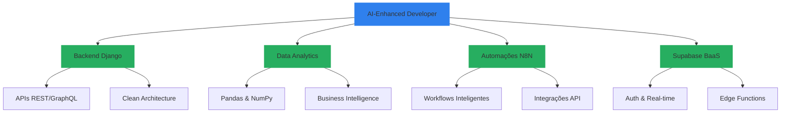

# <div align="center">Olá!  Eu sou José Ferreira</div>

<div align="center">
  <a href="https://git.io/typing-svg">
    
  </a>
</div>

> 💡 **Desenvolvedor Backend Python/Django + Analista de Dados** que combina expertise matemática, engenharia de software e **Inteligência Artificial** para criar soluções escaláveis e inovadoras. Especialista em automações, análise de dados e desenvolvimento assistido por IA para máxima produtividade e qualidade de código.

<div align="center">
  <a href="https://www.linkedin.com/in/josé-ferreira-9a659a242/">
    
  </a>
  <a href="https://api.whatsapp.com/send?phone=+5588993693516">
    
  </a>
  <a href="mailto:jjose150697@gmail.com">
    
  </a>
</div>

## 🎯 Especialidades

```python
class AIEnhancedDeveloper:
    def __init__(self):
        self.core_stack = {
            "backend": ["Django", "Django REST Framework", "Django Ninja", "Celery"],
            "frontend": ["HTML5", "CSS3", "JavaScript"],
            "database": ["PostgreSQL", "MySQL", "Redis", "Supabase"],
            "data_analytics": ["Pandas", "NumPy", "Matplotlib", "Seaborn", "Jupyter"],
            "automation": ["N8N", "Zapier", "Python Scripts", "API Integration"],
            "ai_tools": ["GitHub Copilot", "Claude", "ChatGPT", "Cursor", "V0.dev"]
        }
        
        self.security_expertise = {
            "frameworks": ["Django Security Middleware", "JWT", "OAuth2"],
            "practices": ["OWASP Top 10", "Security Headers", "Data Encryption"],
            "tools": ["SSL/TLS", "Security Auditing", "Penetration Testing"]
        }
        
        self.ai_enhanced_workflow = {
            "development": "Desenvolvimento 5x mais rápido com IA",
            "code_quality": "Código otimizado e testado com assistência IA",
            "architecture": "Design patterns sugeridos por IA",
            "debugging": "Resolução inteligente de bugs"
        }
        
        self.differentials = {
            "ai_development": "Desenvolvedor potencializado por IA",
            "data_driven": "Análise de dados para decisões estratégicas",
            "automation": "Automações inteligentes com N8N",
            "full_stack_plus": "Backend + Frontend + Data + AI",
            "supabase_expert": "BaaS moderno para desenvolvimento ágil"
        }
    
    def ai_powered_development(self):
        """IA como copiloto, não substituto. Código inteligente, desenvolvimento estratégico."""
        return {
            "productivity": "5x mais produtivo",
            "quality": "Código mais limpo e testado",
            "innovation": "Soluções criativas com IA",
            "learning": "Aprendizado contínuo assistido"
        }
```

## 🤖 Desenvolvimento com IA - Meu Diferencial

> **"Não sou apenas mais um 'coda fofo'. Eu sei codar E uso IA estrategicamente para otimizar cada linha de código."**

### 🧠 Como uso IA no desenvolvimento:
- **🚀 Velocidade 5x**: GitHub Copilot + Cursor para autocompletar inteligente
- **🔍 Code Review IA**: Análise automática de código para bugs e melhorias
- **📐 Arquitetura Assistida**: IA sugere padrões de design e melhores práticas
- **🐛 Debug Inteligente**: Resolução rápida de problemas com assistência IA
- **📝 Documentação Auto**: Geração automática de docs e comentários
- **🧪 Testes Inteligentes**: IA ajuda a criar casos de teste mais robustos

## 🚀 Stack Completa + IA

<details>
<summary>🐍 Backend & APIs</summary>

### Backend Expertise


</details>

<details>
<summary>📊 Análise de Dados</summary>

### Data Analytics


</details>

<details>
<summary>⚡ Automação & Integrações</summary>

### Automation Stack


</details>

<details>
<summary>🤖 IA & Ferramentas de Desenvolvimento</summary>

### AI-Enhanced Development


</details>

<details>
<summary>🗄️ Banco de Dados & Cloud</summary>

### Database & Cloud


</details>

## 🎓 Formação & Expertise Completa



### 🌟 Diferenciais Competitivos Únicos

#### 🤖 **Desenvolvedor IA-Enhanced** 
- Uso estratégico de IA para acelerar desenvolvimento sem perder qualidade
- Código 5x mais rápido mantendo padrões de excelência
- Debugging inteligente e otimização assistida por IA

#### 📊 **Analista de Dados + Desenvolvedor**
- Transformo dados em insights acionáveis com Pandas, NumPy e visualizações
- Dashboards interativos e relatórios automatizados
- Análise preditiva para tomada de decisões

#### ⚡ **Especialista em Automações N8N**
- Workflows inteligentes que conectam sistemas diversos
- Automação de processos repetitivos e integrações complexas
- APIs orquestradas para máxima eficiência operacional

#### 🚀 **Expert Supabase**
- BaaS moderno para desenvolvimento ágil
- Real-time, Auth, Edge Functions e PostgreSQL integrado
- Alternativa moderna ao Firebase com SQL nativo

#### 🏗️ **Arquiteto Django/DRF**
- APIs RESTful robustas e escaláveis
- Clean Architecture e SOLID principles
- Segurança avançada (OWASP, JWT, OAuth2)

## 📊 Métricas GitHub & Atividade

<div align="center">
  
  
</div>

<div align="center">
  
</div>

## 🎯 Projetos em Destaque

<div align="center">
  <a href="https://github.com/josejfs/PYTHON/tree/main/GERENCIAMENTO_DE_MERCEARIA">
      
  </a>
</div>

### 🚀 Soluções que desenvolvo:

```python
PORTFOLIO = {
    "backend_apis": {
        "django_rest": "APIs robustas com Django REST Framework",
        "authentication": "JWT, OAuth2, autenticação multi-fator",
        "integrations": "Integrações com serviços externos via API"
    },
    
    "data_analytics": {
        "business_intelligence": "Dashboards e relatórios automatizados", 
        "data_processing": "ETL com Pandas e automação de análises",
        "visualization": "Gráficos interativos com Plotly e Matplotlib"
    },
    
    "automation": {
        "n8n_workflows": "Automações complexas entre sistemas",
        "api_orchestration": "Orquestração inteligente de APIs",
        "data_pipelines": "Pipelines automatizados de dados"
    },
    
    "modern_stack": {
        "supabase": "Backend-as-a-Service completo",
        "real_time": "Aplicações real-time e collaborative",
        "edge_functions": "Funções serverless otimizadas"
    }
}
```

## 💡 Formação Acadêmica Completa

```python
ACADEMIC_BACKGROUND = {
    "graduacao": {
        "em_andamento": "Engenharia de Computação",
        "concluido": [
            "Licenciatura em Matemática", 
            "Tecnólogo em Análise e Desenvolvimento de Sistemas"
        ]
    },
    "especializacao": {
        "concluido": [
            "Segurança da Informação",
            "Big Data e Inteligência Competitiva"
        ],
        "em_andamento": "Engenharia de Software"
    },
    "diferenciais": {
        "matematica": "Base sólida para algoritmos e análise de dados",
        "seguranca": "Desenvolvimento seguro e auditoria de sistemas",
        "big_data": "Processamento de grandes volumes de dados"
    }
}
```

## 🎯 Por que escolher meu trabalho?

### 💼 **Entrega de Valor Real**
- **Não sou só mais um desenvolvedor**: Combino desenvolvimento, análise de dados e automações
- **IA como diferencial**: Uso IA para entregar mais rápido sem comprometer qualidade  
- **Visão estratégica**: Background matemático para soluções otimizadas
- **Full-cycle**: Do banco de dados ao frontend, passando por análises e automações

### 🚀 **Tecnologias Modernas**
- **Backend robusto**: Django + PostgreSQL + Redis para alta performance
- **Supabase**: BaaS moderno para desenvolvimento ágil e escalável
- **N8N**: Automações que economizam horas de trabalho manual
- **IA Tools**: Desenvolvimento acelerado mantendo excelência técnica

### 📊 **Dados + Desenvolvimento**
- **Business Intelligence**: Transformo dados em decisões estratégicas
- **Automação inteligente**: Workflows que otimizam operações
- **APIs inteligentes**: Backends que aprendem e se adaptam

## 📫 Contato Profissional

**Para projetos Django, análise de dados, automações N8N ou desenvolvimento com IA:**

- 💼 **LinkedIn**: [José Ferreira - Developer & Data Analyst](https://www.linkedin.com/in/josé-ferreira-9a659a242/)
- 📱 **WhatsApp**: [+55 88 99369-3516](https://api.whatsapp.com/send?phone=+5588993693516)
- 📧 **Email**: [jjose150697@gmail.com](mailto:jjose150697@gmail.com)

---

<p align="center">
  <i>"IA é minha copiloto, matemática é minha base, Django é minha ferramenta. Juntos, criamos soluções que transformam dados em valor real."</i>
</p>

<div align="center">
  
  
  
</div>

<div align="center">
  
### 🎯 **José Ferreira** - *AI-Enhanced Developer & Data Analyst*
**Django • Python • IA • Análise de Dados • N8N • Supabase**

</div>
