# <div align="center">Olá!  Eu sou José Ferreira</div>

<div align="center">
  <a href="https://git.io/typing-svg">
    
  </a>
</div>

> 💡 **Desenvolvedor Backend Python/Django + Analista de Dados** apaixonado por construir APIs robustas e escaláveis. Combinando expertise matemática com engenharia de software e **Inteligência Artificial** para criar soluções elegantes e eficientes. Especialista em Segurança da Informação, Big Data, automações e desenvolvimento assistido por IA.

<div align="center">
  <a href="https://www.linkedin.com/in/josé-ferreira-9a659a242/">
    
  </a>
  <a href="https://api.whatsapp.com/send?phone=+5588993693516">
    
  </a>
  <a href="mailto:jjose150697@gmail.com">
    
  </a>
</div>

## 🎯 Especialidades

```python
class DeveloperEnhancedByAI:
    def __init__(self):
        self.core_stack = {
            "backend": ["Django", "Django REST Framework", "Django Ninja", "Celery"],
            "frontend": ["HTML5", "CSS3", "JavaScript"],
            "database": ["PostgreSQL", "MySQL", "Redis", "Supabase"],
            "data_analytics": ["Python", "Pandas", "Data Analysis"],
            "automation": ["N8N", "Python Scripts", "API Integration"],
            "practices": ["Clean Architecture", "TDD", "API RESTful", "SOLID"]
        }
        
        self.security_expertise = {
            "frameworks": ["Django Security Middleware", "JWT", "OAuth2"],
            "practices": ["OWASP Top 10", "Security Headers", "Data Encryption"],
            "tools": ["SSL/TLS", "Security Auditing", "Penetration Testing"]
        }
        
        self.ai_development = {
            "approach": "Desenvolvimento otimizado com IA",
            "productivity": "IA para acelerar desenvolvimento",
            "quality": "Código inteligente e eficiente",
            "tools": "Ferramentas de IA para desenvolvimento"
        }
        
        self.differentials = {
            "backend_focus": "Especialista Django/DRF",
            "data_analysis": "Análise de dados integrada",
            "automation": "Automações com N8N",
            "ai_enhanced": "Desenvolvimento assistido por IA",
            "security": "Expert em Segurança da Informação",
            "mathematics": "Fundamentos Matemáticos Sólidos",
            "supabase": "Backend-as-a-Service moderno"
        }
    
    def solve_complex_problems(self):
        """Combinando pensamento matemático com IA e engenharia de software"""
        return ["Arquitetura Escalável", "Análise de Dados", "Automações Inteligentes"]
```

## 🤖 Desenvolvimento com IA

> **Uso IA estrategicamente para otimizar o desenvolvimento, mantendo alta qualidade de código e arquitetura limpa.**

### Como aplico IA no desenvolvimento:
- **🚀 Produtividade**: IA para acelerar desenvolvimento sem comprometer qualidade
- **🔍 Otimização**: Análise inteligente de código e sugestões de melhorias  
- **📐 Arquitetura**: Assistência IA para padrões de design e melhores práticas
- **🧪 Qualidade**: Desenvolvimento inteligente com foco em soluções eficientes

## 🚀 Domínio Técnico

<details>
<summary>🐍 Stack Python/Django</summary>

### Backend Expertise


</details>

<details>
<summary>📊 Análise de Dados</summary>

### Data Analytics


</details>

<details>
<summary>⚡ Automação & Integrações</summary>

### Automation Stack


</details>

<details>
<summary>🎨 Frontend & Design</summary>

### Frontend & Design


</details>

<details>
<summary>🗄️ Banco de Dados</summary>

### Banco de Dados


</details>

<details>
<summary>🔧 DevOps & Ferramentas</summary>

### DevOps & Ferramentas


</details>

## 🎓 Formação & Expertise

```mermaid
graph TD
    A[Desenvolvedor IA-Enhanced] --> B[Backend Django]
    A --> C[Análise de Dados] 
    A --> D[Automações N8N]
    A --> E[Segurança]
    
    B --> F[Clean Architecture]
    B --> G[Design Patterns]
    
    C --> H[Python & Pandas]
    C --> I[Data Processing]
    
    D --> J[Workflows N8N]
    D --> K[Integrações API]
    
    E --> L[OWASP Top 10]
    E --> M[Pentest]
    
    style A fill:#2f80ed,stroke:#2f80ed,stroke-width:2px
    style B fill:#27ae60,stroke:#27ae60,stroke-width:2px
    style C fill:#27ae60,stroke:#27ae60,stroke-width:2px
    style D fill:#27ae60,stroke:#27ae60,stroke-width:2px
    style E fill:#27ae60,stroke:#27ae60,stroke-width:2px
```



### 🌟 Diferenciais Competitivos
- 🏗️ **Especialista Django/DRF**: Desenvolvimento de APIs RESTful robustas e escaláveis
- 📊 **Análise de Dados**: Processamento e análise de dados com Python e Pandas
- ⚡ **Automações N8N**: Workflows inteligentes e integrações entre sistemas
- 🚀 **Supabase Expert**: Backend-as-a-Service moderno para desenvolvimento ágil
- 🤖 **Desenvolvimento com IA**: Uso estratégico de IA para otimizar produtividade
- 🔒 **Segurança Avançada**: Implementação de autenticação JWT, OAuth2 e práticas OWASP
- 🎯 **Arquitetura Limpa**: Código manutenível e testável seguindo SOLID e Clean Architecture
- 💻 **Full Stack**: Domínio de HTML5, CSS3 e JavaScript para soluções web completas
- 📊 **Background Matemático**: Resolução analítica de problemas complexos
- ⚡ **Performance**: Otimização de consultas e cache com Redis

## 📊 Métricas GitHub

<div align="center">
  
  
</div>

## 🎯 Projetos Django em Destaque
<div align="center">
  <a href="https://github.com/josejfs/PYTHON/tree/main/GERENCIAMENTO_DE_MERCEARIA">
      
  </a>
</div>

## 💡 Formação Acadêmica

```python
ACADEMIC_BACKGROUND = {
    "graduacao": {
        "em_andamento": "Engenharia de Computação",
        "concluido": ["Licenciatura em Matemática", 
                     "Tecnólogo em Análise e Desenvolvimento de Sistemas"]
    },
    "especializacao": {
        "concluido": ["Segurança da Informação",
                     "Big Data e Inteligência Competitiva"],
        "em_andamento": "Engenharia de Software"
    }
}
```

## 🚀 O que desenvolvo

### **APIs & Backend**
- APIs RESTful robustas com Django REST Framework
- Autenticação JWT e OAuth2 para segurança avançada
- Arquitetura limpa seguindo princípios SOLID
- Performance otimizada com cache Redis

### **Análise de Dados**
- Processamento de dados com Python e Pandas
- Análises exploratórias para insights de negócio
- Relatórios automatizados e dashboards

### **Automações N8N**
- Workflows inteligentes conectando sistemas diversos
- Automação de processos repetitivos
- Integrações complexas entre APIs e serviços

### **Supabase & Backend Moderno**
- Backend-as-a-Service para desenvolvimento ágil
- Real-time subscriptions e edge functions
- Alternativa moderna ao Firebase com PostgreSQL

### **Desenvolvimento com IA**
- Código otimizado com assistência de IA
- Desenvolvimento mais eficiente mantendo qualidade
- Soluções inovadoras com ferramentas modernas

## 📫 Contato

Para oportunidades de desenvolvimento Django/Python, análise de dados, automações N8N ou discussões técnicas sobre arquitetura de software:

- 💼 LinkedIn: [José Ferreira](https://www.linkedin.com/in/josé-ferreira-9a659a242/)
- 📱 WhatsApp: [+55 88 99369-3516](https://api.whatsapp.com/send?phone=+5588993693516)
- 📧 Email: [jjose150697@gmail.com](mailto:jjose150697@gmail.com)

<div align="center">
  
</div>

---
<p align="center">
  <i>"Arquitetura limpa, análise de dados e automações inteligentes são as bases de um software resiliente. Com IA e Django, transformo complexidade em simplicidade."</i>
</p>

<div align="center">
  
  
</div>
